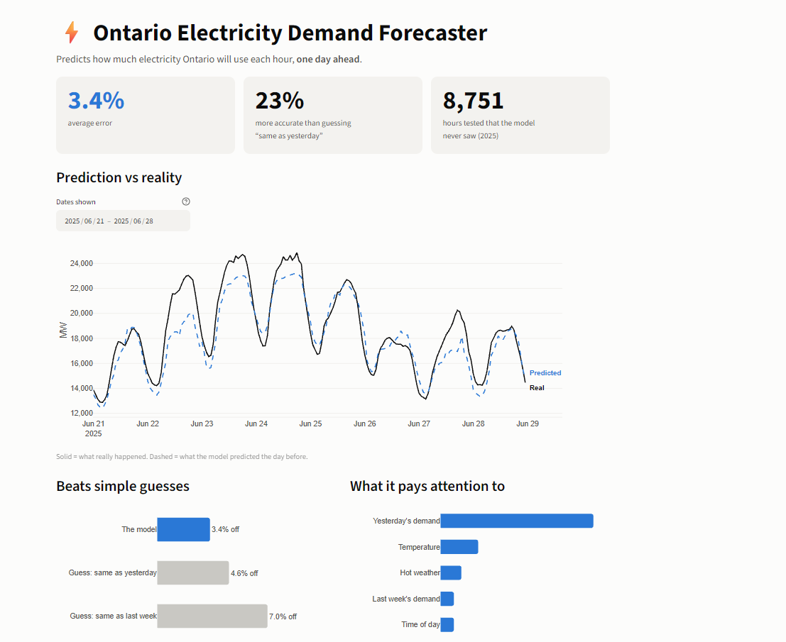
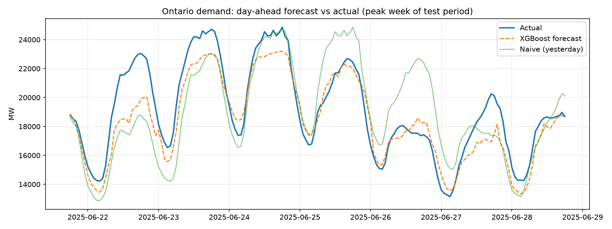
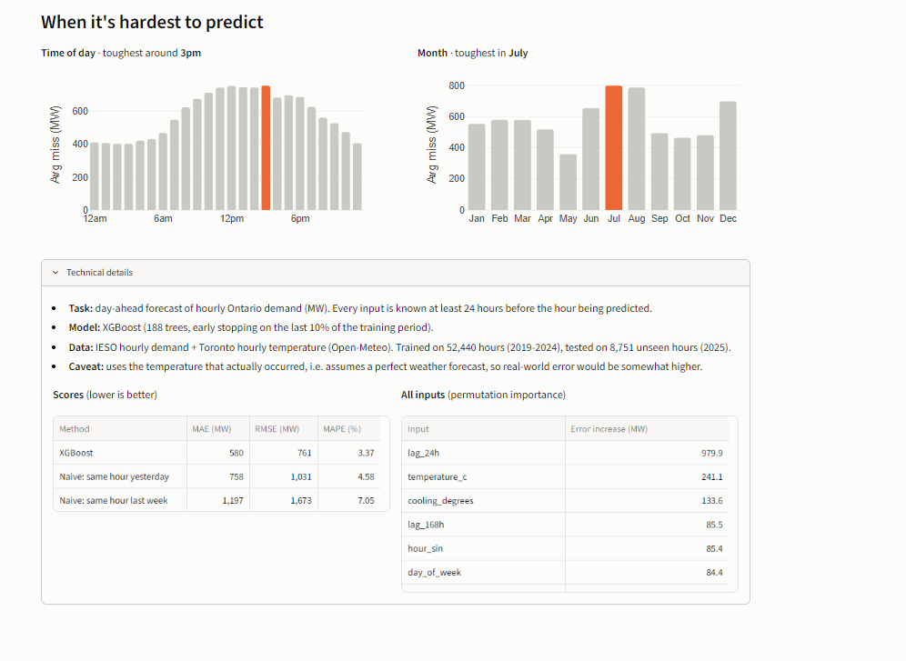
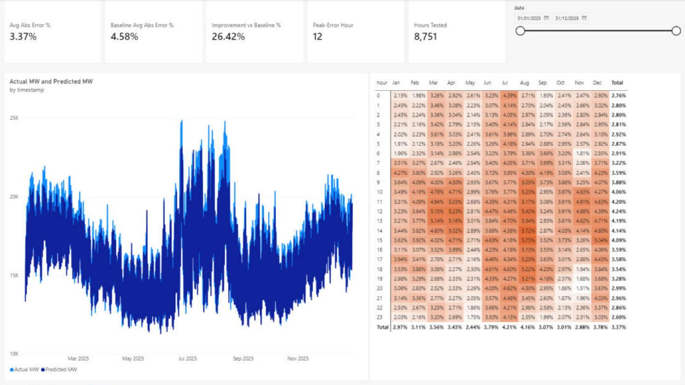
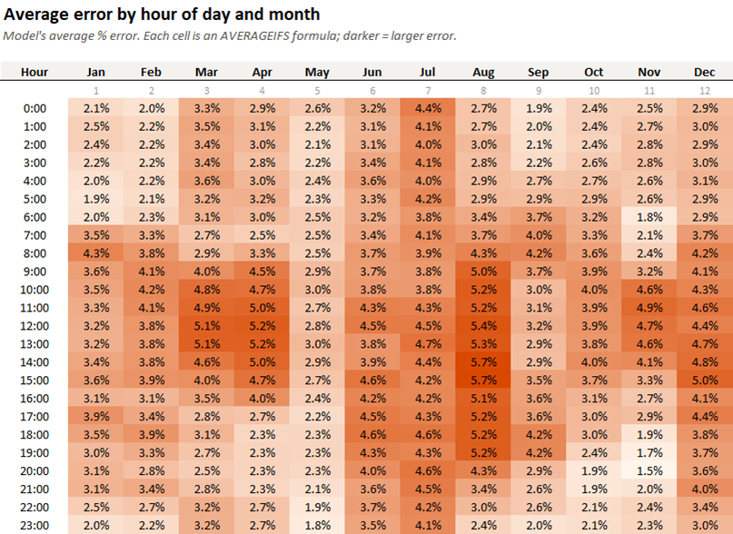

# Ontario Electricity Demand Forecaster

Predicts how much electricity Ontario will use each hour, one day ahead, using
public data from Ontario's grid operator (IESO) and historical weather.



## What it does

- Downloads hourly Ontario electricity demand (2019-2025) and hourly Toronto temperatures.
- Builds features from the calendar, holidays, past demand, and temperature.
- Trains an XGBoost model on 2019-2024 and tests it on all of 2025, a year it never saw during training.
- Compares the model against two simple guesses: "same as this hour yesterday" and "same as this hour last week".
- Shows the results in an interactive Streamlit dashboard.

## Results

Tested on 8,751 hours of 2025 data.

| Method | Average error (MAPE) | Average miss (MAE) | RMSE |
|---|---|---|---|
| XGBoost model | 3.37% | 580 MW | 761 MW |
| Guess: same hour yesterday | 4.58% | 758 MW | 1,031 MW |
| Guess: same hour last week | 7.05% | 1,197 MW | 1,673 MW |

- The model's average miss is 23% smaller than the "same as yesterday" guess.
- The most important inputs are demand at the same hour yesterday, then temperature.
- Errors are smallest overnight and largest in the afternoon, peaking around 3pm.
- July is the hardest month to predict and May is the easiest.

The chart below shows the highest-demand week of 2025, during a late-June heat wave.
The model follows the daily pattern closely but underestimates the highest peaks.
The "same as yesterday" guess falls apart when the weather changes (June 26).



When the model is least accurate:



## How to run

Requires Python 3.10 or newer. From the project folder:

```
pip install -r requirements.txt
python -m forecaster download
python -m forecaster train
python -m streamlit run app.py
```

- `download` fetches the demand and weather data into `data/`.
- `train` trains the model and saves results to `outputs/`.
- The last command opens the dashboard in your browser.

To run the tests: `python -m pytest`

To explore the data, open `notebooks/01_explore_data.ipynb`.

## BI reporting (Excel + Power BI)

`python export_for_bi.py` turns the 2025 test results into files for Excel and Power BI.
Run it after `train`; the files it writes are also committed in `bi/`.

- `bi/forecast_results.csv`: one row per tested hour (8,751 rows) with the real demand,
  the model's prediction, the "same hour yesterday" guess, both errors in MW and in %,
  the hour, month and weekday, and the temperature.
- `bi/forecast_results.xlsx`: the same rows as an Excel Table, plus three sheets built
  on it:
  - **Summary:** average error overall, by month and by hour, and the improvement over
    the baseline, all as live formulas (`AVERAGEIFS`, `COUNTIFS`, `INDEX`/`MATCH`).
  - **Heatmap:** average error for every hour of the day in every month, as formulas
    with a conditional-format colour scale.
  - **Peak week:** an Excel chart of real vs predicted demand for the week of the
    year's highest demand.
- `bi/power_bi/forecast_report.pbix`: a Power BI report built from the CSV, with KPI
  cards, a date slicer, a line chart of real vs predicted demand, and an hour-by-month
  error heatmap.
- `bi/power_bi/`: everything needed to rebuild that report: the Power Query steps
  (`power_query.m`), the DAX measures (`measures.dax`), and a click-by-click guide with
  the values each KPI should show (`BUILD_GUIDE.md`).

The workbook's formulas were recalculated in Excel, and the Power BI report's KPIs and
heatmap cells were checked against the guide's list; both match the results above. The
improvement over the baseline is reported two ways: 23% measured in MW (the figure used
in Results) and 26% measured as a percentage of demand.





## How it works

- **Data:** yearly hourly demand files from IESO, and hourly temperature from the
  Open-Meteo historical weather API. IESO labels each hour by when it ends, in
  Eastern Standard Time all year, so the code converts each row to the hour it starts.
- **Day-ahead rule:** every input must be known at least 24 hours before the hour
  being predicted: demand from 24 hours, 48 hours, and one week earlier, recent
  averages, the time of day and year, weekends, holidays, and temperature. Unit tests
  check that no future data leaks into the features.
- **Time-based testing:** the model trains on 2019-2024 and is tested on 2025, rather
  than on a random split, so the test is a real forecast of unseen data.
- **Feature importance:** each input is shuffled one at a time on the test data to
  measure how much worse the predictions get without it.

## Limitations

- The model is given the actual temperature for the hour it predicts, which assumes
  a perfect weather forecast. A real day-ahead system would only have a forecast, so
  its error would be somewhat higher.
- One weather location (Toronto) stands in for the whole province.
- Results are from a single test year.

## Project structure

```
app.py                  Streamlit dashboard
export_for_bi.py        writes the Excel and Power BI files in bi/
forecaster/
    config.py           settings (years, test period, weather location)
    data.py             download and clean the IESO and weather data
    features.py         calendar, lag, and temperature features
    models.py           time-based split, simple guesses, XGBoost model
    evaluate.py         error scores and feature importance
    pipeline.py         the full training run
bi/                     Excel workbook, CSV, and Power BI build files
notebooks/              data exploration
tests/                  unit tests
docs/images/            screenshots used in this README
```

## Data sources

- IESO Public Reports, hourly demand: https://reports-public.ieso.ca/public/Demand/
- Open-Meteo Historical Weather API: https://open-meteo.com/en/docs/historical-weather-api
